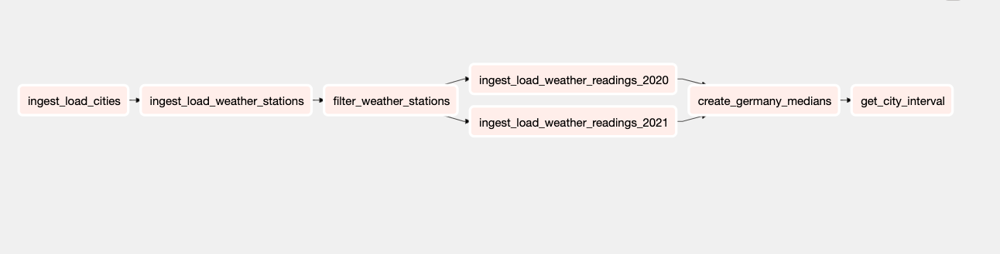

# ETL Using Airflow
---

This document presents the approach the thought process that went into the completion of the task. The document is divided into 3 major reading parts and you can read it any way you prefer (recommend to do one by one only.)


The sections are as follows:

- [Task wise break up and understanding](#Task-wise)
- [Code Architecture and implementation process](#Code-Architecture)
- [Database Design and Schema](#Database-Design)

---

# Task wise

1. **Write a script that imports data into an SQL database**

This was a fairly easy part of the process, it was done by fetching the content from the web using [requests]() library.
The fetched file was then parsed using [pandas]() and uploaded to [postgreSQL]() as a chunk.

This whole pipeline is broken down into small modular and reusable Extract - Load pairs which can be instantiated at runtime.

> The Extract-Load part is highly modular and extensible and since the entire code supports chunking at its core it's highly reliable when given big volumes of data.

2. **Filter the data using SQL only to the relevant pieces**

For this part, I already have German - city and station data in the Postgres DB. I employ cross join here, to map each station against each city and then filter lat and longitude according to the given condition and then load it to the ```city_stations``` table.

While ingesting weather stations reading over multiple years the same process of Extract-load is applied again but there's a sound provision of filter in the pipeline which helps in taking the extra material out before sending it to the DB itself. 

Post the filter of weather station reading for only TMAX, I upload it to DB and then join against the weather station we earlier got by doing distance analysis to remove the excess reading of all the weather stations.

> _I understand cross join is a highly underperforming query and result in massive slowdowns, while I'm thinking of ways to overcome this, a good reason to not worry about this currently is that once ingestion and creation of ```city_stations``` mapping is done, this data would change less frequently, that's why I'm letting it be there for the time being._

3. **Compute the median measurements for all of Germany.**

For this, I grouped by the entire weather station readings table, ```readings```, over ```DATE``` and used ```PERCENTILE_CONT``` within the group to get Germany median temperature over each day for all the readings in the readings table and create a new table as ```germany_medians```

> _**Note**: This type of group-by and window functions can become extremely resource-hungry when these are run for a lot of table entries. A good way to move around this is to keep ```germany_medians``` table and only running ```PERCENTILE_CONT``` for the dates that are present in ```readings``` but not in ```germany_medians``` and then updating these to ```germany_medians```. This is currently not implemented but can surely be integrated._

4. **Find the hotness percentile (how many % of the cities have lower hotness) for a given city**

This was a bit tricky at first but once you break down Germany per day median stats this becomes fairly easy to tackle. We first, take all the reading and filter it on year's interval and then join it with all the city data and then take the median, later on, we take this city-median-date temp data and join it with ```germany_medians``` over date and finally get a cte which has a date, city, and a bool column that whether for the given day the city was hot or not. Then we create an aggregate the bool column over the city name. 

This gives us a table with columns city_name, hotness. We save this as a temp table and finally calculate, percentile over hotness using ```PERCENT_RANK()```.

> _This process seems a lot slower because there are a couple of join and couple of group by(s) involved but the key part here is the filter of the dates at an earlier stage. Since we filter the dates, the data that we are joining / grouping is only of the cities spread over a year. This reduces the memory consumption and also keeps the query fast._

5. **Considering intervals of percentile of 10. Create a table that we can query with a city name and date, and find in which of these intervals it's situated.**

Finally, the interval part is taken care of by using, the floor of percentile * 10 and a small ```CASE-WHEN``` query. This finally creates a table as **city_rank_{date}**, considering whatever city you've entered and date. The table is exactly how it was presented in the challenge and thus one can find the ```percentile_id``` by querying **city_rank_{date}**

---

# Code Architecture

The entire code architecture is separated into three parts majorly:

- Ingestion:
    - Extract
    - Load
- Transformation

This code is built on the ELT foundation, whilst I've tried to justify the ELT fundamentals, any suggestions are most welcome.

Each module is separated with and names as what it is supposed to do.

The ingestion module is responsible for Extract - Load.
The transformation module is responsible for all the transformations, either while ingestion or after ingestion. This is done to produce **separation of concern**. 

Each module is **highly extensible and modular**. This is where object-oriented and composition architecture comes into play. While you can design a source Extract - Load with the same interface but can compose any of it at runtime.

There's a separate module of tasks that is directly related and reads along as the Challenge tasks. These tasks can later be drawn into Airflow Dags to produce a weather_data pipeline and reduce manual interaction.



**Extract-Load** pairs have chunk capability which makes them well enough to pull a large volume of data. While currently, the pipeline lacks multiprocessing but this can surely be accommodated without harming the current architecture.

An application-wide logging scheme is applied which is powered by the app-logger method. One can extend this to include Sentry and Loki logging thus adopting industry SRE patterns.

---
# Database Design

- **Intermediate / Temp tables:**

1. cities
2. stations
3. _Multiple station reading chunk_tables_
4. City_median_agg

- **Final Tables:**

1. city_stations
2. readings
3. city_rank_{date}

---
This task was initially implemented using:
- PostgreSQL 13
- Python 3.7
- Table Plus (for visualization)

Later, added airflow to stir, to create a complete solution.

# How to run the code?

Prereqs:
- Docker and Docker - composr
- Python 3.6+
- git clone this repo and move into the repo folder

## 1. Without Airflow

- Start PostgreSQL docker image locally

```bash
docker run -d -p 5000:5432\              
    --name postgres-db \
    -e POSTGRES_PASSWORD=admin \
    -e PGDATA=/var/lib/postgresql/data/pgdata \
    -v postgres_vol:/var/lib/postgresql/data \
    postgres
```

- Install dependencies (after moving in the ```germany_weather``` folder)

**Recommended using virtualenv**

```bash
python setup.py install
```

- Go to ```weather_pipeline/config.py``` and uncomment ```# no airflow```
comment ```airflow``` part

- Run the pipeline

```bash
python pipeline.py
```

_Note_: To change city or date, open ```pipeline.py``` and change.

> After the pipeline is complete, you can connect your postgres client using port: 5000, user: postgres, password: admin and db:postgres. As mentioned earlier city_rank_{date} can be used to get percentile of any city on date.

## 2. With Airflow

- Go to ```weather_pipeline/config.py``` and uncomment ```# airflow```
comment ```# no airflow``` part

- Run the ```setup.sh``` script
```bash
chmod +x setup.sh
./setup.sh
```

- Go to airflow server @ [localhost:8080](localhost:8080) and run the dag ```Germany_weather```

> After the DAG is complete, you can connect your postgres client using port: 5000, user: airflow, password: airflow and db:postgres. As mentioned earlier city_rank_{date} can be used to get percentile of any city on date.

---